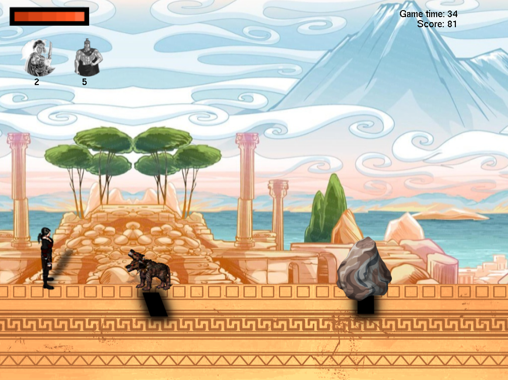
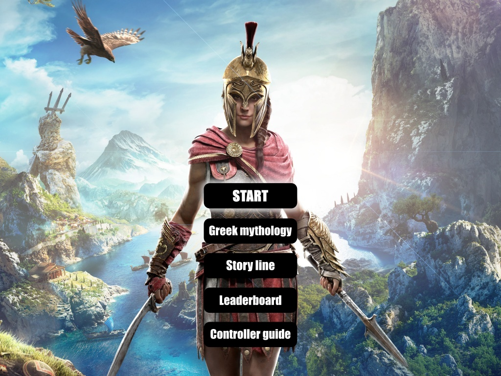
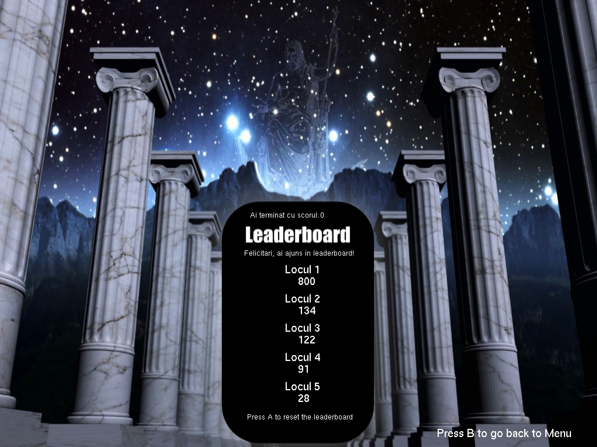

# WomXn Develop - Ubisoft Programming Challenge (2021)

> Archived learning project - my first game.

A small 2D C++ game created in four weeks for the **Ubisoft WomXn Develop Programming Challenge** in 2021.

The project was developed with a proprietary Ubisoft API/framework provided for the challenge. That API and the original asset package are **not included** in this public repository.

## Project Preview

  

  
  &nbsp;&nbsp;
  

## A 2021 Time Capsule

This was my first game and one of my earliest C++ projects. I built it before I had formally studied object-oriented programming in C++, so I spent much more time thinking about game design, mechanics, flow, and getting a complete playable experience working than about software architecture.

I would structure this code very differently today. The implementation reflects my experience and priorities at the time, and I am intentionally keeping the original version rather than rewriting history. Completing a playable game within the four-week challenge was a milestone I was genuinely proud of, and that is why this project still has a place on my GitHub.

## Technical Snapshot

| | |
| --- | --- |
| **Language** | C++ |
| **Year** | 2021 |
| **Context** | Ubisoft WomXn Develop Programming Challenge |
| **Timebox** | 4 weeks |
| **Focus** | Game design, gameplay mechanics, UI, scoring and power-ups |
| **Public repository** | My authored game logic and project screenshots |

## Gameplay I Implemented

- **Player actions:** jump, attack and teleport-to-shadow mechanics
- **Obstacles and enemies:** collision, damage and encounter logic
- **Health system:** player health plus collectible hearts
- **Power-ups:** Apollo and Ares abilities with separate progress systems
- **Scrolling environment:** moving background and ground layers
- **HUD:** health, power-up progress, game time and score
- **Game flow:** main menu, pause, resume, restart, story, mythology and controller-guide screens
- **Scoring and leaderboard:** score calculation and a local top-five leaderboard

## Repository Scope

This public repository intentionally contains only the code I authored for the game, centered around `GameTest.cpp`, plus screenshots documenting the original result.

The challenge project depended on Ubisoft's proprietary framework, including `app/app.h`, and on an asset package that I do not redistribute. Because those dependencies are not public, this repository is an **archive and code showcase**, not a standalone buildable version of the game.

The screenshots document how the original project looked when running in the challenge environment.

## Looking Back

If I were building the project today, I would:

- separate game state, entities, UI and gameplay systems into clearer components and classes
- reduce global state and raw-pointer usage
- separate input, update and rendering responsibilities more cleanly
- move gameplay constants and configuration out of the main implementation

I have deliberately not refactored the original source so that the repository remains an honest snapshot of my early programming work and the progress I have made since then.
